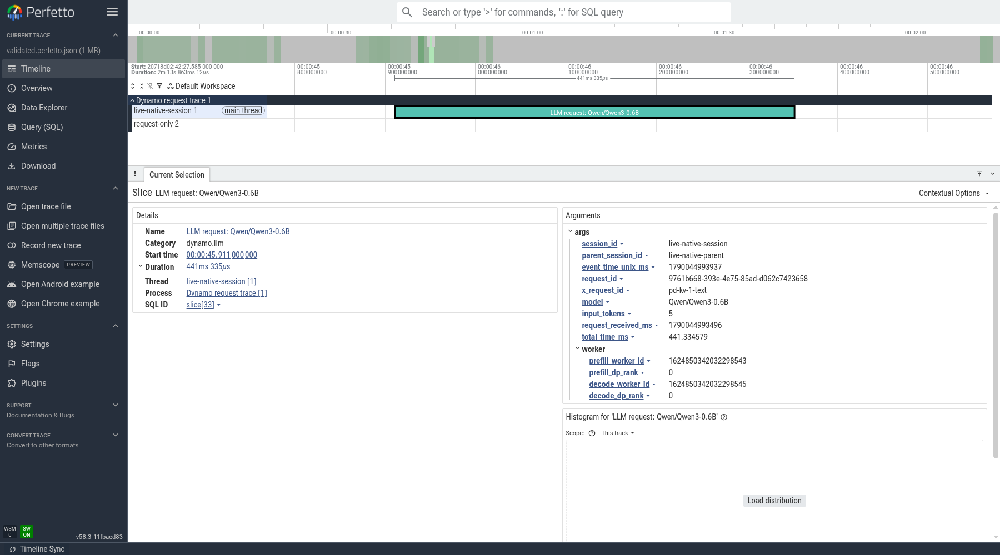

# Native SGLang request tracing: live validation

Evidence for [Dynamo PR #77](https://github.com/ishandhanani/dynamo/pull/77), exact commit `cae515141502c53775c1d29d0f702de6ad07ba45`, tested September 22, 2026.

- Stock SGLang 0.5.19 and Qwen3-0.6B on H100 NVL; aggregated engine and separate prefill/decode engines using NIXL.
- 100 request cases passed across aggregated/P/D, round-robin/KV routing, tracing off/on. Four additional live-stream lifetime checks passed.
- 48 eligible traced requests converted into 48 Perfetto slices. No duplicate trace records, no records for unsupported batch/multiple-output shapes or capture-off requests.
- Screenshot captured from the real Perfetto browser UI, selecting a P/D request with distinct prefill/decode worker IDs. No synthetic timeline or image alteration.

Download [validated.perfetto.json](validated.perfetto.json) and open it at [ui.perfetto.dev](https://ui.perfetto.dev/).

These are HTTP lifetime traces. Output/cached token counts, TTFT/ITL and engine finish metadata remain absent. HTTP completion or cancellation does not acknowledge engine cleanup. Functional debug-build validation, not a throughput benchmark. No SGLang patches or code changes were needed for this run.
