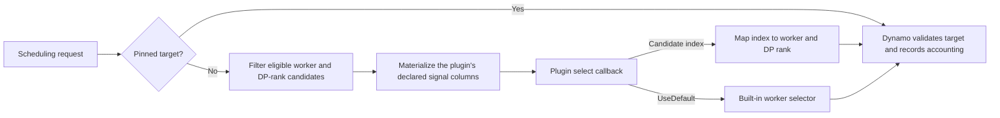

**Experimental.** Available since v1.3.0.

A worker selector plugin replaces the NVIDIA Dynamo KV router's built-in target-selection decision without replacing Dynamo's candidate filtering, target validation, or load accounting. The plugin is a trusted Rust `cdylib` loaded into the frontend process.

## How Selection Runs



Dynamo filters unavailable workers, caller restrictions, overloaded workers, and required taints before calling the plugin. Pinned requests bypass the plugin. After selection, Dynamo validates the returned target against the same eligibility rules and derives the accounting snapshot.

## Build a Strategy

The following cache-first strategy asks Dynamo for cached-token and load columns. It chooses the candidate with the most effective cached tokens, then uses projected load and identity as deterministic tie-breakers.

1. Create a Rust library crate:

```bash
cargo new --lib cache-first
cd cache-first
```

2. Replace `Cargo.toml` with:

```toml
[package]
name = "cache-first"
version = "0.1.0"
edition = "2024"

[lib]
crate-type = ["cdylib"]

[dependencies]
dynamo-worker-selector-plugin-api = "1.3.0"
```

3. Replace `src/lib.rs` with:

```rust
use std::cmp::Reverse;

use dynamo_worker_selector_plugin_api::{
    CandidateInputs, RouterRole, Selection, SelectionInput, WorkerSelectorPlugin,
    export_worker_selector_plugin,
};

struct CacheFirst;

impl WorkerSelectorPlugin for CacheFirst {
    fn from_config(config: &[u8], _role: RouterRole) -> Result<Self, String> {
        if config.is_empty() {
            Ok(Self)
        } else {
            Err("cache-first does not accept configuration".into())
        }
    }

    fn required_candidate_inputs(&self) -> CandidateInputs {
        CandidateInputs::CACHED_TOKENS | CandidateInputs::LOAD
    }

    fn select(&mut self, input: SelectionInput<'_>) -> Result<Selection, String> {
        let cached = input
            .cached_tokens()
            .ok_or_else(|| "cached-token signals are unavailable".to_string())?;
        let loads = input
            .loads()
            .ok_or_else(|| "load signals are unavailable".to_string())?;

        (0..input.candidate_count())
            .min_by_key(|&index| {
                (
                    Reverse(cached[index]),
                    loads[index].active_prefill_tokens,
                    loads[index]
                        .active_decode_blocks
                        .saturating_add(loads[index].additional_active_blocks),
                    input.worker_ids()[index],
                    input.dp_ranks()[index],
                )
            })
            .map(Selection::Candidate)
            .ok_or_else(|| "no eligible candidates".to_string())
    }
}

export_worker_selector_plugin!(CacheFirst);
```

4. Build the shared library:

```bash
cargo build --release
```

5. Start a frontend with the plugin. `DYN_ROUTER_WORKER_SELECTOR_PLUGIN` must contain an absolute path:

```bash
export DYN_ROUTER_WORKER_SELECTOR_PLUGIN="$(pwd)/target/release/libcache_first.so"
export DYN_ROUTER_WORKER_SELECTOR_CONFIG=""
python -m dynamo.frontend --router-mode kv --http-port 8000
```

Dynamo creates independent plugin state for each decode or prefill router it constructs and passes the corresponding `RouterRole` to `from_config`. Use `DYN_ROUTER_WORKER_SELECTOR_CONFIG` for a UTF-8 configuration string shared by both roles, then interpret it by role if needed.

## Choose Candidate Signals

Return the smallest `CandidateInputs` set that implements the decision. Dynamo evaluates `required_candidate_inputs` once after `from_config`, caches the result, and materializes only those columns for each selection.

- Use `IDENTITY` for algorithms based only on worker ID and data-parallel rank.
- Use `CACHED_TOKENS` for effective cache locality.
- Use `CACHE_TIERS` when device, host-pinned, disk, or shared-cache placement matters separately.
- Use `LOAD` for projected active prefill and decode work.
- Use `CAPACITY` to normalize work by published worker limits.
- Use `ROUTING` for stable worker identity and preferred-taint cost adjustment.
- Use `DEFAULT_COST` to layer logic on Dynamo's complete configured worker cost.
- Use `KV_OVERLAP` for only the weighted cache-overlap component of that cost.
- Use `DECODE_LOAD` for only the projected decode-block component.

Dynamo automatically adds `IDENTITY` to any nonempty set. `NONE` skips plugin candidate scanning and materialization and exposes zero candidates; use it for a strategy that always returns `Selection::UseDefault`. The built-in selector then performs its own selection work.

See the [Worker Selector Signal Reference](worker-selector-signals.md) for the accessor and Dynamo source behind every field.

## Design Rules

- Treat every slice and string in `SelectionInput` as callback-scoped. Do not retain references or candidate indexes after `select` returns.
- Do not depend on candidate order. Use explicit tie-breakers such as worker ID and DP rank, or a stable routing ID when assignments should survive worker restarts.
- Keep `select` bounded and nonblocking. It runs synchronously on the scheduler actor's request path, and calls for one plugin state are serialized.
- Return `Selection::UseDefault` to compose a narrow custom rule with Dynamo's configured built-in selector.
- Return an error for invalid plugin configuration or an impossible input. Dynamo rejects out-of-range candidate indexes and revalidates selected targets.
- Test an empty candidate set, worker and DP-rank churn, missing optional capacity or stable IDs, and deterministic tie behavior.

The plugin runs as trusted native code in the frontend process, not in a sandbox or sidecar. A plugin can block or terminate the frontend. The export macro catches unwinding panics, but a plugin compiled with `panic = "abort"` can still terminate the process.

Use the [custom worker selector example](https://github.com/ai-dynamo/dynamo/tree/main/lib/kv-router/examples/custom-worker-selector) as a minimal source-tree build. The [plugin API source](https://github.com/ai-dynamo/dynamo/blob/main/lib/worker-selector-plugin-api/src/lib.rs) defines the safe Rust contract and its C ABI.
