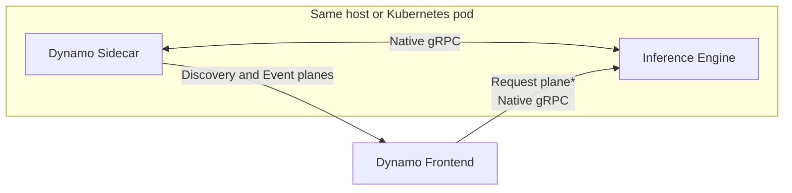

> [!WARNING]
> **Experimental.** Sidecar packaging, launchers, and API coverage are still
> evolving. The sidecar path does not yet match every feature of the in-process
> backends.

A Dynamo sidecar runs beside the inference engine process. It registers the
engine with Dynamo discovery and forwards engine events into the Dynamo event
plane. Today, requests also pass through the sidecar. The target design routes
requests directly to the engine's native gRPC service.

## Design Goals

- Keep the upstream engine's native serve path and argument surface.
- Move toward public, versioned gRPC contracts with explicit backward
  compatibility instead of importing private engine APIs.
- Isolate Dynamo and engine dependencies in separate processes.
- Attribute failures through engine-specific and Dynamo-specific logs and health
  checks.
- Reuse Dynamo's frontend, routing, planning, and disaggregated-serving
  orchestration.

## Architecture



<sup>*</sup> The direct request path is the target design. Today, requests pass
through the sidecar.

In the target design, the frontend and router resolve the engine endpoint
through discovery, then send requests directly to the engine. The sidecar stays
off the request path and uses the engine's native gRPC service for metadata and
event integration with Dynamo's discovery and event planes.

## Target Responsibilities

| Layer | Responsibility |
|---|---|
| Dynamo frontend and router | OpenAI-compatible API, preprocessing, routing, and direct native gRPC requests to the engine |
| Dynamo sidecar | Engine registration and discovery, plus metadata and event forwarding |
| Inference engine | Native gRPC request serving, scheduling, sampling, token generation, KV cache, and GPU execution |

## Container Packaging

The sidecar Dockerfile builds all three engine-specific sidecar executables into
one CPU-only image. Deployments select an engine by setting the container
`command`:

| Engine | Container command |
|---|---|
| vLLM | `dynamo-vllm-sidecar` |
| SGLang | `dynamo-sglang-sidecar` |
| TensorRT-LLM | `dynamo-trtllm-sidecar` |

The image's default entrypoint, `dynamo-sidecar`, maps the short names `vllm`,
`sglang`, and `trtllm` onto those executables. It is a convenience for ad-hoc
`docker run`; the deployment manifests override it with `command`. The inference
engine remains in a separate GPU container, so the sidecar image does not
include vLLM, SGLang, TensorRT-LLM, CUDA, or engine-specific Python
dependencies.

No published sidecar image is available yet. Build the sidecar image from the
[sidecar Dockerfile](https://github.com/ai-dynamo/dynamo/blob/main/lib/sidecar/Dockerfile).

## Current Readiness

| Backend | Local launcher | Kubernetes example |
|---|---|---|
| [vLLM](../../modular-components/backends/vllm/sidecar.md) | Aggregated and disaggregated | Aggregated and disaggregated |
| [SGLang](../../modular-components/backends/sglang/sidecar.md) | Aggregated and disaggregated | Aggregated and disaggregated |
| [TensorRT-LLM](../../modular-components/backends/tensorrt-llm/sidecar.md) | Aggregated | Aggregated |

Disaggregated launch paths require multiple GPUs and use NIXL for KV transfer.
This table describes validated launch topologies, not feature parity with the
in-process backends.

## Direct Dispatch (Experimental)

The target design's direct request path is available for vLLM behind two
opt-ins, one on each side:

- The sidecar advertises a frontend-routable address for the engine's gRPC
  service with `--advertise-grpc-endpoint` (or `DYN_ADVERTISE_GRPC_ENDPOINT`).
  It is published in the worker's runtime config as `native_grpc_endpoint`,
  together with the role the engine serves (`native_grpc_mode`).
- The frontend process sets `DYN_ROUTER_DIRECT_DISPATCH=vllm`. Every KV routing
  host then connects to each advertising worker and sends admitted requests to
  vLLM directly. Workers that do not advertise an endpoint keep using the
  request plane, so a fleet can migrate one worker at a time.

The vLLM sidecar can also register the worker with a
[standalone selection service](../../modular-components/router/standalone-selection.md)
over HTTP (`--selection-catalog-url`, with a heartbeat-renewed lease and
deregistration on shutdown), publishing the advertised gRPC address as the
dispatch endpoint and vLLM's own KV-event ZMQ publishers as the event sources.
Together with direct dispatch this is the runtime-free registration path: no
etcd or NATS is needed between that worker and a selector.

Selection, booking, cancellation, and error semantics are unchanged: the direct
path uses the same request conversion, stream adapter, and gRPC-status error
mapping as the sidecar, so a dispatch failure releases the router's booking and
reaches the migration layer with the same error type it would have had over the
request plane. The sidecar stays in the pod for registration, KV events, and
health. Request-plane fault detection does not observe direct-dispatch
failures; worker liveness comes from discovery.

## Running Without etcd Or NATS

None of the three planes requires an infrastructure daemon on a single host or a
shared-filesystem VM group:

| Plane | Setting | Effect |
|---|---|---|
| Discovery | `DYN_DISCOVERY_BACKEND=file` (+ `DYN_FILE_KV=<shared dir>`) or `mem` | Registrations live in files (or in-process); no etcd. |
| Request | `DYN_REQUEST_PLANE=tcp` (default) | Frontend to worker over TCP; no NATS. With direct dispatch, straight to the engine's gRPC. |
| Event | `DYN_EVENT_PLANE=zmq` (default) | Workers publish KV events over ZMQ; the router subscribes directly. |
| Selection | `DYN_ROUTER_EMBEDDED_SELECTION=1` | Scheduling on the embedded selection partition, whose replica sync is ZMQ. |

Validated locally with `dynamo.frontend --router-mode kv` and two
`dynamo.mocker` workers under exactly these settings, with no etcd or NATS
process running: the model was served within ten seconds and chat completions
succeeded. Across Kubernetes pods, use `DYN_DISCOVERY_BACKEND=kubernetes`, or
the selection-catalog registration above, in place of the file backend.

At build time, `dynamo-runtime` gates the etcd transport and discovery backend
behind the `etcd` Cargo feature and the NATS request plane, NATS event plane,
and NATS service registration behind the `nats` feature (both on by default).
A binary built with `--no-default-features` links neither `etcd-client` nor
`async-nats`; `DYN_DISCOVERY_BACKEND` then defaults to `mem`, and selecting
`etcd` or a NATS plane is rejected with an explicit error naming the feature.
The file, memory, and Kubernetes discovery backends, the TCP request plane, and
the ZMQ event plane are always compiled in.

## Running Without A Distributed Runtime (Experimental)

`dynamo.frontend --static-workers-file <path>` assembles the frontend with no
`DistributedRuntime` at all: no discovery backend, request plane, or event
plane is constructed. The pieces are:

| Concern | Source |
|---|---|
| Model card and tokenizer | `--model-path` (a local model directory), read locally. |
| Worker membership | The workers file: a JSON list of selection-service worker records (the same shape `dynamo-selection-service --workers-file` loads). `endpoint` is the worker's direct gRPC endpoint, `kv_events_endpoint(s)` its ZMQ KV-event publisher. |
| Selection | An embedded selection service. With KV-event endpoints it subscribes to the workers' ZMQ publishers and routes KV-aware; without any, routing is load-based. |
| Dispatch | The direct engine transport named by `DYN_ROUTER_DIRECT_DISPATCH` (currently `vllm`), connected once per worker at startup. |

```bash
cat > workers.json <<'EOF2'
[
  {"worker_id": 1, "endpoint": "http://10.0.0.11:50051",
   "kv_events_endpoint": "tcp://10.0.0.11:5557", "block_size": 16,
   "total_kv_blocks": 65536, "max_num_batched_tokens": 8192},
  {"worker_id": 2, "endpoint": "http://10.0.0.12:50051",
   "kv_events_endpoint": "tcp://10.0.0.12:5557", "block_size": 16,
   "total_kv_blocks": 65536, "max_num_batched_tokens": 8192}
]
EOF2
DYN_ROUTER_DIRECT_DISPATCH=vllm python3 -m dynamo.frontend \
  --model-path /models/Qwen3-0.6B --model-name Qwen/Qwen3-0.6B \
  --kv-cache-block-size 16 --router-mode kv --static-workers-file workers.json
```

Workers are vLLM sidecars started with `--advertise-grpc-endpoint` (or any
process serving vLLM's gRPC service). Membership is fixed for the life of the
process; a worker that is unreachable at startup is registered for selection
but never chosen. Disaggregated serving, multimodal encoders, and worker
churn need the runtime-backed frontend.

### Feeding A Catalog From Kubernetes

For a standalone selection service (or any consumer of its `/workers` API) on
Kubernetes, `dynamo-selection-catalog-feeder` mirrors Ready pods into the
catalog without gateway objects or a Dynamo runtime. It watches one namespace
with an equality label selector and registers each Ready pod with a lease:
`POST /workers` when the pod becomes Ready, `POST /workers/{id}/heartbeat`
every third of the TTL, `DELETE /workers/{id}` when it leaves. A feeder that
dies stops heartbeating, so its registrations expire.

```bash
dynamo-selection-catalog-feeder \
  --catalog-url http://selection:8080 --namespace inference \
  --selector app=vllm,role=decode --model-name Qwen/Qwen3-0.6B \
  --port 50051 --block-size 16 --kv-event-port 5557 --data-parallel-size 1 \
  --total-kv-blocks 65536 --max-num-batched-tokens 8192 --ttl-secs 30
```

Worker ids are the hash of the pod name (the same id the Kubernetes discovery
backend and the EPP derive), so a pod is addressed consistently across
feeders. Run one feeder per pool; a prefill pool and a decode pool are two
feeders with different selectors and routing groups.

See the
[sidecar Dockerfile, source, and engine-specific READMEs](https://github.com/ai-dynamo/dynamo/tree/main/lib/sidecar)
for implementation details.
