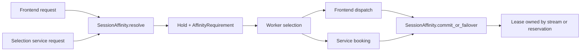

<!--
SPDX-FileCopyrightText: Copyright (c) 2026 NVIDIA CORPORATION & AFFILIATES. All rights reserved.
SPDX-License-Identifier: Apache-2.0
-->

# Shared session affinity

`SessionAffinity` owns the bindings and request lifecycle. Routing hosts supply a liveness callback and retain their own leases. The table lives in `../affinity.rs`; `resolver.rs` implements resolve, dispatch validation, and failover; `replication.rs` defines the shared binding event and applier.

`resolve` acquires a hold before selection, checks liveness, and reinitializes bindings to departed workers. It can be cancelled while waiting on another initializer or yielding during repeated invalidations. A full table routes without a session binding. `query_target` reads a binding without acquiring a lease.

## Selection and ownership

`AffinityRequirement { target, mode }` carries the existing `SessionAffinityMode` to the scheduler. Hard mode narrows selection to an eligible bound target, independently of the selection policy. Soft mode supplies a preference the policy may override. The default policy limits materialization to an eligible Soft target before scoring; custom policies remain advisory unless they opt in. Explicit request pins remain separate exact constraints. Hard affinity does not narrow queue admission: it waits in the router only when all eligible workers are busy; otherwise it runs on its bound worker and queues there.

| Host | Liveness | Commit point | Lease owner |
|---|---|---|---|
| Selection service and standalone EPP | partition catalog membership and rank | after booking, before installing the reservation | reservation row |
| Frontend KV | discovery membership and DP-rank range | after dispatch returns a response stream | response stream |
| Frontend builtin modes | discovery membership | after dispatch returns a response stream | response stream |

The KV frontend embeds `SelectionService` and uses that service partition's table. It resolves and holds sessions outside `SelectionCore`, passing only the affinity requirement into selection. Builtin routing uses the same `SessionAffinity` directly. The table owns its replication sink and therefore the frontend transport runtime; no frontend coordinator is needed. Prefill and decode keep separate tables because they serve different worker pools and can have different TTLs.

`check_dispatch` rejects a live Hard mismatch before frontend dispatch, preserving the binding because nothing ran. A policy filtering out the enforced Hard target releases that binding so a retry can rebind. Filtering other candidates when the target was already excluded keeps the binding. Transient overload and unavailability return retryable service errors and keep the binding. The service commits after booking; a rejected commit drops the binding and the armed booking handle frees capacity. For the frontend, a worker departing during selection releases the replacement booking and reacquires an initializing hold before reselecting; competing requests wait for that initialization before dispatch. The frontend then uses `commit` after successful dispatch. The service uses `commit_or_failover` after booking, without awaiting another initializer behind booked capacity. Revision and version checks keep stale holds from erasing a replacement binding.

## Replication

`AffinityBindingEvent` contains the routing partition, session id, worker and optional rank, and `(sequence, writer_id)` version. `replica_sink` queues this event for the host transport. `SessionAffinity::apply_replica_event` checks partition and writer identity, advances the clock, checks host liveness, and applies the versioned binding.

The selection service uses its existing ZMQ peer mesh and `dynamo.session-affinity.v1` topic. The frontend uses its runtime event plane and `session_affinity_events` subject. Both carry the same payload; neither has a legacy schema or dual-publish path. These are internal protocols and replicas must run compatible versions. Frontends use their discovery instance id as writer id; the service uses a random nonzero process id.

Replica startup installs the writer id and sink together, once per table. Failed or cancelled startup can be retried. Frontend subscribers hold weak table references, so dropping the last table owner shuts down the transport without a reference cycle.

## Configuration and errors

`SessionAffinityConfig` validates TTL, mode, entry limit, and session-id limit. Its `ttl_from_secs_f64` checks TTL inputs from Python and CLI configuration. Frontend, standalone service, and EPP all expose Hard/Soft mode with Hard as the default.

Hosts map `AffinityError` into their existing error types. Invalid request targets or session ids are client errors. Cancellation maps to core shutdown or frontend request cancellation. The full-table fallback is handled by `resolve`, without introducing another error type or counter.
