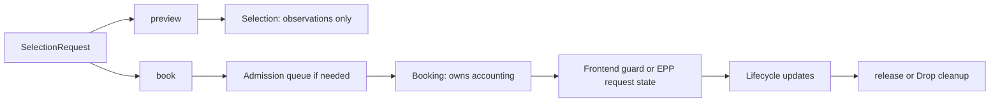
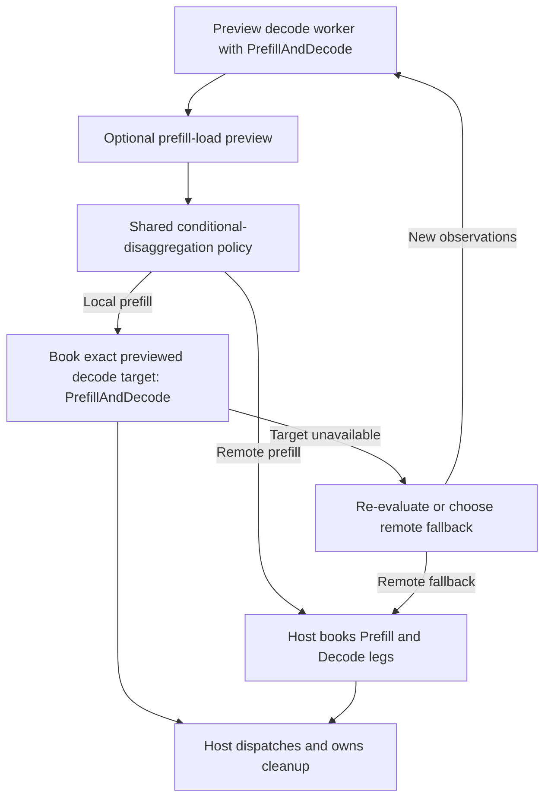

<!--
SPDX-FileCopyrightText: Copyright (c) 2025-2026 NVIDIA CORPORATION & AFFILIATES. All rights reserved.
SPDX-License-Identifier: Apache-2.0
-->

# Shared Selection API

Status: proposed implementation contract, 2026-09-21. This document consolidates the API discussion and adversarial review; it does not describe an implemented or released API.

Baseline: NVIDIA Dynamo's merged selection-core refactor, [PR #14570](https://github.com/ai-dynamo/dynamo/pull/14570), head `1b82fe24d7357351dc851f6d8cecd38dbb7b1fd5`. The frontend already uses the shared core at this baseline. This proposal cleans up its caller-facing contract; it does not propose another scheduler.

## Decisions at a glance

- Expose two placement operations: `preview(request)` and `book(request)`.
- Return a read-only `Selection` from `preview`; return an owned `Booking` from `book`.
- Use the same request, result, error, and lifecycle vocabulary in the frontend, Endpoint Picker (EPP), Python bindings, and HTTP adapter.
- Describe work explicitly as `Prefill`, `Decode`, or `PrefillAndDecode`. Keep placement scoring separate from work accounting.
- Keep backend dispatch, response handling, cancellation, and key-value (KV) transfer cleanup in the host adapters.
- Remove the old selection API after migrating all in-tree callers. Do not add compatibility aliases or cached-selection replay.
- Preserve existing scheduling, affinity, replication, and cache behavior unless a change is explicitly listed here.

The common path reads: **book a worker, dispatch the request, record progress, release the booking.** Conditional routing adds a preview before booking.

## Vocabulary

| Name | Meaning | Does not mean |
|---|---|---|
| Selection | A chosen worker target and the observations that informed the choice | Admitted work or a promise that the target remains available |
| Preview | Choose using current observations without admission or booking | Queue until execution is safe |
| Booking | Ownership of one admitted attempt's scheduler accounting | Engine execution, physical GPU-memory allocation, or a KV-transfer reservation |
| Worker target | Worker ID and exact data-parallel (DP) rank | Endpoint address or worker pool |
| Routing partition | The model and routing group whose workers can be considered | The work a selected worker will perform |
| Request work | The prefill/decode work assigned to this leg | A scoring policy or a pool name |
| Request ID | Correlation across logs, retries, and routing legs | A unique accounting identity |
| Booking ID | Unique identity of one admitted attempt | An identifier to reuse for retries or both P/D legs |
| Host adapter | Frontend, EPP, Python, or HTTP integration around selection | An alternative scheduler |

Use `preview` instead of an unqualified `select`: the name makes its advisory nature visible at the call site. Use `book` instead of `select_and_reserve`: selection and accounting are one operation, and the returned noun is `Booking`. Do not add `handoff`, `commit`, or `detach` to the request API. Moving a booking into a request guard transfers ownership using normal language mechanisms.

## Public Rust Surface

The following signatures define the intended surface. Supporting types and imports are abbreviated; these are design examples, not copy-paste implementations.

```rust
impl SelectionService {
    /// Choose a target without entering the admission queue or booking load.
    pub async fn preview(
        &self,
        request: &SelectionRequest<'_>,
    ) -> Result<Selection, SelectionError>;

    /// Choose, admit, and account for one attempt. May wait for admission.
    pub async fn book(
        &self,
        request: &SelectionRequest<'_>,
    ) -> Result<Booking, SelectionError>;
}

pub struct Selection {
    pub target: WorkerTarget,
    pub signals: SelectionSignals,
}

#[derive(Clone, Copy, Debug, PartialEq, Eq)]
pub struct WorkerTarget {
    pub worker_id: WorkerId,
    pub dp_rank: DpRank,
}

#[must_use]
pub struct Booking {
    // Private identity, accounting state, and cleanup owner.
    // Not Clone. Not serializable. Movable between request owners.
}

impl Booking {
    pub fn id(&self) -> BookingId;
    pub fn selection(&self) -> &Selection;
    pub fn kv_hint(&self) -> Option<&KvHint>;

    pub async fn mark_prefill_complete(&self) -> Result<(), BookingError>;

    /// Cumulative generated tokens across all output choices for this attempt.
    pub fn record_decode_progress(&self, generated_tokens: u64)
        -> Result<(), BookingError>;

    /// Refresh liveness without inventing token progress.
    pub fn record_activity(&self) -> Result<(), BookingError>;

    /// Consume ownership and wait for local accounting release.
    pub async fn release(self) -> Result<(), BookingError>;
}
```

`WorkerTarget` is the public name for the existing worker-plus-rank concept, not a second competing target representation. `BookingId` is an opaque, copyable, globally unique value with a stable string representation for transport and logs. Its value must not encode client request IDs as the sole uniqueness source.

`record_activity` is a small addition to the earlier proposal. EPP and HTTP owners can observe liveness without observing exact token counts; they need an explicit way to refresh expiry without fabricating decode progress. Token progress also refreshes liveness. Callers with reliable progress events normally do not call both.

### Request

```rust
pub struct SelectionRequest<'a> {
    pub request_id: &'a str,
    pub partition: RoutingPartitionRef<'a>,
    pub prompt: PromptView<'a>,
    pub work: RequestWork,
    pub expected_output_tokens: Option<u32>,
    pub session: Option<&'a SessionContext>,
    pub constraints: SelectionConstraints<'a>,
    pub scoring: ScoringOverrides,
    pub accounting: AccountingOverrides,
    pub policy_class: Option<&'a str>,
    pub priority: RequestPriority,
    pub deadline: Option<tokio::time::Instant>,
}

pub enum RequestWork {
    Prefill,
    Decode,
    PrefillAndDecode,
}

pub struct SelectionConstraints<'a> {
    pub allowed_worker_ids: Option<&'a HashSet<WorkerId>>,
    pub required_target: Option<WorkerTarget>,
    pub preferred_target: Option<WorkerTarget>,
    pub routing: &'a RoutingConstraints,
}

pub struct RequestPriority {
    pub strict_priority: u32,
    pub priority_jump: f64,
}

#[derive(Default)]
pub struct ScoringOverrides {
    pub overlap_score_credit: Option<f64>,
    pub prefill_load_scale: Option<f64>,
    pub router_temperature: Option<f64>,
    pub shared_cache_multiplier: Option<f64>,
}

#[derive(Default)]
pub struct AccountingOverrides {
    pub assume_kv_reuse: Option<bool>,
    pub track_prefill_tokens: Option<bool>,
}
```

Ordinary callers supply work and leave both override groups at their defaults. The explicit accounting group preserves existing per-request capabilities; it is not a requirement to configure boolean combinations for normal routing. Do not silently remove those capabilities while renaming the API.

| Field | Contract |
|---|---|
| `request_id` | Required, nonempty correlation ID. May repeat across attempts and P/D legs. Never used alone to release accounting. |
| `partition` | Model name and routing group. Resolves the candidate pool; does not infer `work`. |
| `prompt` | Borrow existing token buffers and metadata. Preserve multimodal routing tokens, block metadata, precomputed hashes, prompt length, LoRA identity, cache namespace, and EAGLE mode. |
| `work` | Required; no implicit aggregate/decode default. |
| `expected_output_tokens` | Estimate for decode-capacity projection, not a generation limit. `None` uses configured estimation for work containing decode. Must be `None` for a prefill-only leg. |
| `session` | Full existing `SessionContext`: session ID, parent session ID, terminal marker, and input trigger. Absence remains absence. |
| `constraints` | Eligibility and target restrictions, as defined below. |
| `scoring` | Optional placement-score overrides. `None` inherits effective service configuration. |
| `accounting` | Optional accounting overrides within the valid envelope of `work`. `None` inherits effective service configuration. |
| `policy_class` | Existing queue/policy class label; preserve configured class resolution and fallback semantics. |
| `priority` | Preserve existing semantics: higher strict priority precedes policy score; priority jump modifies ordering within that model. Defaults are `0` and `0.0`; reject nonfinite jump values. |
| `deadline` | Absolute monotonic deadline for the selection operation, including lookup and admission. Preserve it across previews and retries; `None` adds no caller deadline and does not disable service limits. |

Retain the existing `PromptView` normalization contract: multimodal routing tokens take precedence over ordinary token IDs; otherwise use the complete hash-only tuple of block hashes, sequence hashes, and input length. Validate lengths and metadata before admission. Borrowing avoids copying the frontend prompt merely to call selection; asynchronous internal ownership must still be explicit.

All scoring overrides must be finite. Credit, load scale, and temperature are nonnegative; shared-cache multiplier is in `[0, 1]`. Credit may exceed `1`. The old `overlap_score_weight` alias is not part of this new selection API. A separately supported inference-client protocol can still normalize its legacy fields in its adapter.

### Eligibility and Target Constraints

Apply constraints in this order:

1. Resolve the routing partition, live catalog membership, worker capabilities, LoRA availability, and routing restrictions.
2. Intersect with `allowed_worker_ids`, when supplied. `None` means no extra restriction; an empty set means no candidates.
3. Apply `required_target`, including its exact DP rank, and any hard session binding. Neither can bypass eligibility.
4. Pass `preferred_target` and soft affinity to placement policy. They are not guarantees and cannot make an ineligible worker selectable.

A required target outside an explicitly supplied allowed set, conflicting required targets, or a required target conflicting with a valid hard binding is `InvalidRequest`. A structurally valid required target that has departed, drained, or become ineligible is `TargetUnavailable`. If no target is required and no eligible worker remains, return `NoEligibleWorker`. Capacity pressure on an otherwise eligible target follows admission policy; it is not an invalid-constraints error.

If both target fields are supplied, they must identify the same target. A worker-only restriction belongs in `allowed_worker_ids`; it does not implicitly require DP rank zero. Preserve custom-policy behavior for soft affinity rather than converting all preferences into hard pins.

### Work and Accounting

| Routing leg | Target pool | `work` | Local prefill accounting | KV-reuse accounting |
|---|---|---|---|---|
| Aggregated serving | Aggregate | `PrefillAndDecode` | Configured prefill tracking | Configured reuse policy |
| Remote prefill | Prefill | `Prefill` | Configured prefill tracking | Configured reuse policy |
| Decode after remote prefill | Decode | `Decode` | Off | Do not subtract local prompt reuse from incoming KV accounting |
| Conditional bypass of remote prefill | Decode | `PrefillAndDecode` | Configured prefill tracking | Configured reuse policy |

For `Decode`, explicitly requesting `track_prefill_tokens = true` or `assume_kv_reuse = true` is invalid. Adapters normalize inherited settings when constructing a remote-decode request, as the current disaggregated frontend already does. For work containing prefill, the two optional overrides retain their existing behavior. Active-block tracking, output tracking, decay, and estimator configuration remain supported setup policies; they are not all derivable from `RequestWork`.

Do not infer placement scoring from this table. Ordinary disaggregated decode currently chooses load-only scoring by setting overlap credit to zero. Conditional disaggregation can retain configured or request-specific overlap credit on its remote-decode leg. Both use `RequestWork::Decode` and the same no-local-prefill accounting.

`Prefill` means no ongoing decode leg is booked on that worker. A backend can still return an early terminal token during prefill; the host handles that response without inventing a separate decode booking.

### Selection Signals

```rust
pub struct SelectionSignals {
    pub prompt_tokens: u64,
    pub block_size: u32,
    pub overlap: CacheOverlap,
    pub effective_cached_tokens: u64,
    pub effective_prefill_tokens: u64,
    pub potential_decode_blocks: u64,
    pub decode_busy: Option<bool>,
    pub worker_load: Option<WorkerLoad>,
}

pub struct CacheOverlap {
    pub longest_matched_tokens: u64,
    pub gpu_tokens: u64,
    pub cpu_tokens: u64,
    pub disk_tokens: u64,
    pub per_dp_gpu_tokens: BTreeMap<DpRank, u64>,
}

pub struct WorkerLoad {
    pub active_prefill_tokens: u64,
    pub prefill_token_capacity: u64,
    pub total_kv_blocks: Option<u64>,
    pub prefill_busy: Option<bool>,
}
```

- `overlap` reports raw matched-prefix observations using the existing tier-summary semantics. CPU and disk counts are cumulative prefixes, not additive cache-hit buckets. The per-DP map preserves rank-specific observations; the target's rank is always explicit.
- `effective_cached_tokens` is the cache-weighted estimate used by scheduling, not a raw GPU residency count. `effective_prefill_tokens` is `prompt_tokens - min(prompt_tokens, effective_cached_tokens)`. It remains a diagnostic estimate even when local prefill accounting is disabled.
- `potential_decode_blocks` is projected load including this request, not free capacity or this request's allocation alone.
- `worker_load` preserves the scheduler's selected-worker load snapshot. It is available for advisory preview; a booking result may omit it rather than trigger an extra diagnostic lookup.
- `decode_busy` and `prefill_busy` preserve configured threshold semantics. `None` means unavailable or not configured, never `false`. A policy requiring a busy signal must handle its absence explicitly.
- Observations are not a cluster-wide atomic snapshot. Preview cannot promise that cache contents or load remain unchanged until admission.

Keep `KvHint` on `Booking`, where any associated retained cache-chain lifetime can be owned. A preview does not retain that lifetime. Missing hints mean no usable hint is available; they do not imply a cache miss or permission to skip required transfer logic.

## Admission and Ownership



### Preview

- Run shared normalization, eligibility, cache lookup, and placement policy without queue admission.
- Do not create a booking, reserve capacity, bind a new session, or create a replay entry. Read existing affinity without creating a binding.
- Lookup caches, traces, and metrics may still change; this is not a promise of a pure function.
- Apply the deadline to asynchronous preparation. A successful preview is never sufficient authority to dispatch accounted work.

### Book

- Run selection and admission as one operation. A separate preceding preview is optional.
- Return success only after one attempt's accounting exists and a cleanup owner is installed. This is local scheduler atomicity, not a cross-replica transaction or a two-worker P/D transaction.
- Guard the admission-to-return interval. Cancellation must retract pending work and release any attempt admitted before the caller received its booking.
- Recheck expiry before publishing success. If admission races the deadline, clean up the attempt and return `DeadlineExceeded` rather than an unowned success.
- A borrowed `SelectionRequest` need not outlive the returned `Booking`. Retain only the state required for lifecycle, hints, and cleanup.
- Do not accept a `Selection` or preview ID as a substitute for the full request. Booking recomputes what it needs; cached replay is removed.

### Booking Lifecycle

| Operation or event | Required effect |
|---|---|
| `mark_prefill_complete()` | Idempotently stop this booking's prefill accounting and acknowledge the local update. The first transition refreshes liveness. Does not release its remaining accounting. For `Decode`, an idempotent no-op. |
| `record_decode_progress(n)` | Record a cumulative count across all output choices for this booking, refresh liveness on forward progress, and enqueue block-accounting updates only as needed. Duplicate or older counts do not add load or extend liveness. Invalid for a prefill-only booking. |
| `record_activity()` | Refresh the host-configured inactivity lease without changing token or block counts. Does not revive an expired booking or extend a hard lifetime cap. |
| `release()` | Consume the owner, enqueue cleanup, and wait for local acknowledgement. Already-expired accounting counts as released. This is not a cluster-wide replication barrier. |
| Drop | Enqueue identity-fenced cleanup without blocking. Does not promise cleanup has completed when Drop returns. |
| Expiry | Stop updates for the expired attempt; release its local accounting under existing ownership rules. A live language object does not disable configured expiry. |

Synchronous progress/activity calls acknowledge local acceptance, not backend execution or peer delivery. Serialize or atomically merge concurrent updates. Coalesce accounting at block boundaries; do not introduce a per-token async round trip. For a cumulative jump over several boundaries, account for every crossed boundary with the existing decay semantics.

Cancellation of `release()` must not cancel the cleanup already enqueued. Shutdown must drain acknowledged cleanup where possible; process crashes are handled by the existing replica/expiry recovery model, not by claiming that Rust Drop always runs.

Every retry and each prefill/decode leg gets a fresh `BookingId`. Lifecycle updates and cleanup are fenced by booking identity, worker incarnation, and internal attempt identity. An old callback must never affect a newer attempt, even when the client request ID is reused.

Before dispatching a replacement attempt, await release of the failed attempt when current retry ordering requires it. Do not replace the frontend's release-before-retry guarantee with eventual Drop cleanup.

### What release does not do

Releasing scheduler accounting does not cancel an engine request, abort a transport, invalidate a session binding, or clean staged KV data. The host performs those operations in backend-appropriate order and retains ownership until it has arranged cleanup. A dispatch error is not by itself evidence that a worker or session binding is invalid.

Do not add `release_failed()`. Target invalidation requires evidence of target invalidity, not merely a failed or cancelled request.

## Host Integration

The public request API must not expose scheduler descriptors, public `Book` versus `Lease` modes, or a disarmed owner. Keep a narrow, documented cross-crate integration module for `dynamo-llm` and other hosts that need lifecycle hooks.

| Responsibility | Owner after migration |
|---|---|
| Prompt normalization, eligibility, cache preparation, policy, admission | Existing `SelectionCore` behind `SelectionService` |
| Booking identity, guarded admission, accounting release | `Booking` and private core machinery |
| Endpoint resolution, dispatch, retries, response stream | Frontend/EPP host |
| Engine cancellation and staged-KV cleanup | Host and backend protocol |
| Canonical output-token hashing and per-choice cache materialization | Token-aware frontend integration |
| Local/replica accounting ownership, expiry publication rules | Existing lifecycle/replication integration |
| Worker discovery and catalog reconciliation | Existing control-plane integration |
| Topology decision for conditional disaggregation | Shared policy invoked by the host |

The frontend integration must preserve approximate-LRU acquisition and release, canonical multimodal/LoRA/cache-namespace hash lineage, per-choice output materialization, activity refresh, attempt fencing, and request metrics. A token count is not enough to reconstruct token hashes. Keep the token-aware hook associated with the booking's private identity; do not expose that descriptor to ordinary callers or duplicate the accounting owner in the request guard.

### Session Affinity

Preserve the current host lifecycle distinction through setup-time integration:

- Frontend: resolve/steer through its existing affinity integration and commit a binding after successful dispatch.
- Core-managed EPP/standalone service: hold and commit the binding while admitting, as today.
- Preview: consult existing affinity without acquiring a long-lived binding or committing a new one.

`SessionContext` carries policy metadata; it does not secretly choose among these lifecycles. Each service/adapter is wired once with the appropriate affinity integration. Do not expose per-request `Bind`, `SteerOnly`, or `SessionBinding` switches. Unifying the two host policies is separate work, not a side effect of renaming APIs.

## Frontend Call Flows

### Aggregated Serving

```rust
// request.work = RequestWork::PrefillAndDecode
let booking = selection.book(&request).await?;
let target = booking.selection().target;
let guard = RequestGuard::new(booking); // owns cleanup immediately
dispatch(target, payload, guard).await?;
```

The guard marks prefill completion at the supported response event, reports cumulative decode progress, and retains the token-aware cache hooks. On completion it awaits release. On dispatch failure or cancellation it performs host cleanup and releases the booking. Merely resolving an endpoint does not transfer ownership to the engine.

### Disaggregated Serving

- Prefill leg: `book(prefill_request)` with `work = Prefill`.
- Decode leg: `book(decode_request)` with `work = Decode` and the appropriate scoring policy.
- Retain distinct owners for both legs. If the second booking or dispatch fails, clean up any first leg that already exists.
- Release the prefill booking when the backend protocol says that leg is finished; release decode accounting when the decode leg finishes.

Do not force a universal sequence of “finish prefill, then book decode.” The frontend can overlap decode setup with prefill bootstrap. A terminal prefill response can finish the request without decode. Cancellation after KV staging can require a backend cleanup path even when ordinary client work has stopped.

The caller deadline bounds selection, not the host's separate bounded cleanup budget. Preserve the current cancellation/staged-KV rules; do not run cleanup under an already-expired client deadline and abandon transferred state.

## EPP Call Flows

### Aggregated Serving

```rust
let booking = selection.book(&request).await?;
let endpoint = resolve_endpoint(booking.selection().target)?;
request_state.set_booking(booking); // move owner before returning the pick
return_pick(endpoint);
```

Keep the booking owned while resolving the endpoint and constructing the response. If any step fails, release it. The request's retained state, not the returned worker ID, owns cleanup. ID-based callbacks look up that retained owner by `BookingId`.

Standalone EPP replaces its `select_and_reserve` wrapper with this flow. Embedded EPP replaces its decode “choose without booking, then `add_request`” path with the same `book` operation. Embedded prefill already has a booking lifecycle; migrate its owner and terminology rather than adding a second booking.

### Disaggregated Serving

When the backend protocol requires prefill and decode targets before forwarding, EPP books both legs and retains both owners before returning the routing information. If either leg fails, release the other; do not return a half-constructed P/D pick. This is compensating cleanup, not atomic two-worker admission.

EPP can have weaker response observations than the native frontend. A nonempty body chunk is not an exact generated-token count. Use backend-supported completion events, explicit usage counts when available, and `record_activity` for liveness. Do not fabricate token counts or infer a universal prefill-complete event from arbitrary bytes. Preserve and document any existing backend-specific first-response approximation in the adapter.

### Capability Boundary

The shared API does not add a backend's P/D orchestration protocol to a standalone raw-worker EPP deployment. Conditional disaggregation in EPP additionally requires a host that can express both the local-prefill route and the remote-prefill route, retain their owners, and clean up their backend resources.

## Conditional Disaggregation in Either Host

The shared policy chooses topology; selection chooses and accounts for workers. Do not add a special `conditional_book` API.



1. Preview the decode pool for **local prefill plus decode**, including the request's real prompt, constraints, session, scoring, priority, and deadline.
2. If the configured policy needs prefill-busy information, preview the relevant prefill target/pool as required by that policy. Do not replace a chosen-worker probe with an unrelated pool average.
3. Apply the shared conditional-disaggregation policy to those observations.
4. For local prefill, construct a full booking request with `work = PrefillAndDecode` and `required_target = decode_preview.target`, including its DP rank. Keep the same deadline.
5. If the required target is unavailable, re-evaluate or take the documented remote-prefill fallback. Never silently choose another decode worker under the previous decision.
6. For remote prefill, construct the two leg requests with their own work and scoring intent. The host handles sequencing, dispatch, and cleanup.

Binding the target does not freeze its cache contents or load. This proposal preserves advisory topology decisions; it does not introduce admission-time cache-hit predicates. If a future policy requires a strict admission-time condition, add and test that condition explicitly rather than interpreting preview as a reservation.

Invalid constraints and cancellation are terminal for that attempt. A topology fallback must not hide malformed requests, drop hard restrictions, or reset the deadline.

## Errors

Preserve machine-readable error kinds across Rust, Python, HTTP, and EPP. Display strings provide context, not control flow. Keep worker/queue details structured and preserve the source error internally.

| Selection error | Meaning | HTTP status |
|---|---|---|
| `InvalidRequest` | Malformed prompt, unsupported work/override combination, or contradictory explicit constraints | 400 |
| `NotReady` | Required service/index provider is not ready | 503 |
| `NoEligibleWorker` | No currently eligible candidate in the requested partition | 503 |
| `TargetUnavailable` | Required exact target is not currently eligible/available | 503 |
| `Overloaded` | Eligible workers cannot admit under the configured overload policy | 429 |
| `QueueRejected` | Queue policy explicitly rejected the request; include structured reason | 503 |
| `DeadlineExceeded` | Lookup/admission did not complete within the selection deadline | 504 |
| `Internal` | Unexpected implementation/provider failure | 500 |

Dropping a Rust future is cancellation, not an error returned to that dropped caller. Transport adapters map their own cancellation signals without inventing a successful selection.

Booking lifecycle errors distinguish `Expired`, `InvalidWork`, `Unavailable`, and `Internal`. A prefill-only booking rejects decode-progress updates as `InvalidWork`. Release of expired accounting succeeds. Late transport updates to a missing/expired owner return a stable `booking_not_found` response (404), while repeated HTTP DELETE succeeds (204). No callback recreates a missing owner.

## Python and HTTP Adapters

### Python

Expose the same operation names and typed results. Python `book()` returns an owned `Booking` wrapper, not a JSON dictionary containing the only lifecycle identifier. Provide async context-manager cleanup:

```python
async with await service.book(request) as booking:
    target = booking.selection.target
    # Host dispatch/response handling retains this owner.
    await booking.mark_prefill_complete()
    booking.record_decode_progress(total_generated_tokens)
```

Context exit awaits release on success or exception. Explicit `await booking.release()` is supported and subsequent context exit is harmless. Prevent use-after-release with a typed exception. Finalization is a fallback, not the normal cleanup mechanism. Cancellation while awaiting the Rust booking future retains the same guarded-admission guarantee.

Define typed input/result stubs and preserve error kinds. A Python-owned request buffer must remain valid for the Rust await; do not expose borrowed Rust lifetimes directly or require JSON encode/decode for in-process Rust callers.

### HTTP

Retain the HTTP adapter. It owns a private `BookingId -> Booking` registry because an HTTP response cannot carry an RAII owner.

| Route | Effect |
|---|---|
| `POST /preview` | Return `Selection`; no registry entry |
| `POST /bookings` | Accept the full request, admit, install the owner, return `booking_id`, `selection`, optional `kv_hint`, and lease policy |
| `POST /bookings/{booking_id}/prefill-complete` | Call `mark_prefill_complete` |
| `POST /bookings/{booking_id}/decode-progress` | Accept `{ "generated_tokens": n }`; call `record_decode_progress` |
| `POST /bookings/{booking_id}/activity` | Refresh liveness without token progress |
| `DELETE /bookings/{booking_id}` | Remove and explicitly release the owner; idempotent |

Transport rules:

- Serialize an owned equivalent of `SelectionRequest`; convert to the borrowed core view at the boundary. Reject unknown fields in the new selection schema rather than silently accepting old replay or admission-mode fields.
- Represent the caller's remaining selection budget as `timeout_ms`; derive a monotonic deadline at ingress. Rust `Instant` is never serialized. Clients recompute remaining time across calls instead of restarting the original timeout.
- Install the registry owner before publishing a successful booking response. Cancellation before installation must release the guarded booking; installation races are resolved by the registry's own ownership guard.
- A completed booking-response connection is not the engine-request lifetime. Do not release an installed booking merely because that HTTP connection closes.
- Require a finite configured inactivity timeout for HTTP-owned bookings. Return `idle_timeout_ms` and any configured `max_lifetime_ms`. Forward token progress, the first prefill-completion transition, and explicit activity renew only the inactivity deadline; duplicate/stale progress does not. Reject new bookings during shutdown and drain existing registry ownership under the service's shutdown policy.
- Clients retain the returned ID, send activity when a live request has no measurable progress, and explicitly DELETE on completion. Expiry releases accounting, not engine work; the execution owner still handles engine cancellation and must not continue indefinitely after losing its booking.
- A lost booking response can leave an owner that expires without a client knowing its ID. Bound that orphan by the inactivity timeout. `POST /bookings` has no implicit idempotency or automatic retry guarantee; a retry creates a new attempt and may temporarily over-account until the orphan expires. Do not claim exactly-once remote booking. Durable idempotent recovery is a separate feature if a caller requires it.
- Lifecycle requests must reach the owning service instance. Do not treat replicated accounting as replicated RAII ownership. Preserve existing peer mirrors and expiry rules; cross-instance ownership failover is not introduced here.

Endpoint addresses, when needed by a wire caller, are adapter-resolved metadata in the booking response. They are not part of `WorkerTarget` identity and are not a second selection decision.

## What changes in the implementation

| Existing surface or behavior | Replacement | Reason |
|---|---|---|
| Ambiguous `select`, including queued-unbooked operation | `preview` for observation; `book` for execution | Make admission and side effects visible in the verb |
| `select_and_reserve` | `book` | One name for one admitted, accounted choice |
| `create_reservation` from cached selection ID | Full `book` request, optionally constrained to an exact target | Remove hidden cached inputs and stale replay semantics |
| Public `Query` / `Advisory` / `Book` / `Lease` switches | Two entry points with fixed contracts | Callers choose intent, not cleanup implementation |
| Public `Selected` fields conditional on admission mode | `Selection` plus opaque `Booking` | Avoid partially populated lifecycle objects |
| Raw descriptors and public `commit`/ownership disarming | Move the `Booking` into a guard or registry | Keep one cleanup owner throughout the attempt |
| ID-addressed `prefill_complete`, `add_output_block`, and `free` for in-process callers | Methods on the owned booking | Fence lifecycle by the attempt being updated |
| Per-block output callbacks exposing decay mechanics | Cumulative `record_decode_progress` | Keep accounting units and decay inside the implementation |
| Mixed placement/accounting overrides | `work`, `scoring`, and optional advanced `accounting` groups | Avoid deriving scoring from work or losing supported overrides |
| Embedded EPP decode query followed by `add_request` | One `book` call | Eliminate the unowned choose-then-account interval |
| Existing frontend booking descriptor adoption | Booking retained by `RequestGuard` plus narrow integration hooks | Preserve cache/lease behavior without exposing internals |
| Python/HTTP reservation dictionaries and routes | Owned Python wrapper; HTTP-owned registry | Preserve ownership across each transport boundary |

The queued-but-unbooked behavior of `query_instance_id` is deliberately removed from the selection boundary. Diagnostic users migrate to `preview` and no longer wait for admission. Any caller that will execute a request must migrate to `book`; retaining the old call sequence under a new name would lose admission/accounting guarantees.

### File-Level Work

Paths below refer to the pinned refactor baseline, not the older local checkout.

| Area | Files | Planned change |
|---|---|---|
| Public contract | `lib/kv-router/src/services/selection/{mod.rs,service.rs,types.rs,error.rs,input.rs}` | Define/re-export the new types, two entry points, validated input, and typed errors; keep wire conversion separate from core errors |
| Shared implementation | `lib/kv-router/src/services/selection/core/{operation.rs,run.rs,reservations.rs}` | Map both operations into the existing common path; replace caller-visible modes, remove pending-selection replay, retain fenced direct lookup and replica mirrors |
| Ownership and accounting | `lib/kv-router/src/scheduling/queue.rs` and lifecycle/sequence support | Build `Booking` on existing guarded admission; add cumulative progress/activity facade and cancellation-safe acknowledged release |
| Frontend selection adapter | `lib/llm/src/kv_router.rs`, `kv_router/embedded.rs`, `kv_router/routing_host/kv_selection.rs` | Construct the common request, expose advisory preview only where needed, retain exact constraints and complete metadata |
| Frontend lifecycle | `kv_router/routing_host/request_guard.rs`, `kv_router/request_lease.rs`, `kv_router/routing_host.rs` under `lib/llm/src/` | Retain the Booking; port lease/cache hooks and release-before-retry ordering |
| Conditional routing | `lib/llm/src/kv_router/prefill_router/` and `lib/kv-router/src/conditional_disagg.rs` | Use preview/book vocabulary, preserve target/deadline continuity, preserve topology-dependent scoring |
| Embedded and standalone EPP | `deploy/inference-gateway/ext-proc/src/{epp.rs,epp_router.rs,selector.rs}` | Book every execution leg; store owners before returning picks; map callbacks without fabricated token progress |
| HTTP | `lib/kv-router/src/services/selection/server.rs` | Replace selection/reservation routes; own booking registry, expiry, and lifecycle lookup |
| Python | `lib/bindings/python/rust/llm/kv.rs`, `lib/bindings/python/src/dynamo/_core.pyi`, and in-tree Python callers | Add owned wrapper/context manager and typed shapes; remove old selection methods and update callers |
| Tests and documentation | Selection, scheduler, frontend, ext-proc, and binding tests; public type docs and host examples | Migrate fixtures and assertions; add the contract tests below; remove stale vocabulary |

Keep catalog updates, readiness, load diagnostics, overlap diagnostics, replication setup, and discovery reconciliation as separate control/diagnostic APIs. Do not rename worker administration or redesign plugins, configuration precedence, affinity policy, or backend protocols as incidental cleanup. Normal request dispatch should not depend on reaching through `service.core()` to raw selection machinery.

### Delivery Order

1. Define the new request/result/error types and `Booking` owner over the existing core. Add lifecycle contract tests before changing callers.
2. Migrate the frontend and its private integration hooks; validate aggregated and disaggregated paths, retries, cancellation, and approximate-LRU behavior.
3. Migrate both EPP implementations, including the embedded decode accounting gap. Validate each currently supported backend protocol.
4. Migrate Python, HTTP, and all other in-tree consumers, including tests, mocks, and offline/replay tools.
5. Delete the old entry points, mode exports, replay cache, reservation DTOs/routes, and unused helpers. Compile all affected crates/bindings to prove no callers remain.
6. Land the canonical API reference and executable host examples with the implementation. Add EPP conditional-disaggregation execution as a separately validated feature if its host/backend support is not already present.

Temporary internal adapters can make intermediate commits buildable, but none become supported aliases in the final change. This no-compatibility decision applies to the selection API, not automatically to inference-client headers, backend protocols, or unrelated operator configuration.

## Acceptance Tests

The implementation is complete only when these behaviors are covered, not merely when the names compile.

| Contract | Required evidence |
|---|---|
| Preview is advisory | No queue entry, booking, session bind, or replay state; no side effect on accounted load |
| Booking is owned | Exactly one owner and one local accounting entry; endpoint-resolution and dispatch failures leave no leaked attempt |
| Cancellation and deadline | Cancel during lookup, queueing, admission-to-return, registry installation, and release; eventually no orphaned in-process accounting or pending queue entry |
| Retry fencing | Old progress, expiry, and release callbacks cannot mutate a new attempt with the same request ID; failed-attempt release is acknowledged before replacement dispatch |
| Constraints | Required target preserves DP rank; allowed-set and hard-affinity conflicts error; unavailable target does not silently fall back |
| Progress | Duplicate/out-of-order cumulative counts are harmless; multi-boundary jumps and multiple choices account correctly; no per-token async round trip |
| Expiry | Activity renews inactivity only; expired owner cannot be revived; local expiry does not acquire peer-release authority |
| Work versus scoring | Remote decode has no local prefill charge while conditional overlap preference survives; ordinary load-only disagg still uses zero overlap credit |
| Prompt and session parity | Tokens, multimodal data, hash-only input, LoRA, cache namespace, EAGLE, full session metadata, policy class, and priority survive every adapter that accepts them |
| Frontend lifecycle | Approximate-LRU prompt acquisition, per-choice output hashing/materialization, metrics, and staged-KV cleanup retain baseline behavior |
| P/D ownership | Failure of either leg releases owned accounting; overlapping bootstrap and prefill-terminal/no-decode paths remain valid |
| Conditional routing | Busy-signal absence, exact-target departure, deadline-preserving fallback, and hard-constraint conflicts have explicit outcomes |
| EPP observations | No execution pick without retained ownership; bytes do not become fabricated tokens; disconnect/completion cleanup covers both legs |
| Python and HTTP | Context exit, explicit release, cancellation, unknown/expired IDs, idempotent DELETE, lost booking response, expiry, and owner-instance routing behave as documented |
| Performance | Compare the same representative frontend/EPP workload against the refactor baseline; report latency, throughput, allocations, and cleanup/queue behavior before accepting a regression |

Existing tests at the pinned refactor head are baseline evidence, not proof of these proposed APIs. This document-only change does not run or claim implementation, backend, or performance validation.

## Human and Agent Documentation

Keep one contract rather than two independently evolving specifications:

- Rust public type/method docs own exact side effects, ownership, validation, cancellation, errors, and units. Compile their examples.
- A curated reference page links those types and presents the request/lifecycle tables for Rust, Python, and HTTP.
- A host-integration guide contains the frontend/EPP diagrams, token-aware hooks, affinity timing, and P/D cleanup rules.
- A short agent-facing entry links the same reference and guide, with the rules “preview is not admission,” “every executing leg owns a booking,” “request ID is not booking ID,” and “release is not backend cancellation.” It must not restate a second API specification.

Keep this standalone proposal out of the shipped API reference until the implementation exists. When landing the implementation, move its stable contract into those canonical locations and remove or mark this proposal as historical.

## Source Anchors

These links pin the behaviors that constrain this design to the reviewed refactor head:

- [Existing shared operation and public admission modes](https://github.com/ai-dynamo/dynamo/blob/1b82fe24d7357351dc851f6d8cecd38dbb7b1fd5/lib/kv-router/src/services/selection/core/operation.rs#L28).
- [Guarded booking handle and acknowledged cleanup](https://github.com/ai-dynamo/dynamo/blob/1b82fe24d7357351dc851f6d8cecd38dbb7b1fd5/lib/kv-router/src/scheduling/queue.rs#L364).
- [Core-managed affinity commit during admission](https://github.com/ai-dynamo/dynamo/blob/1b82fe24d7357351dc851f6d8cecd38dbb7b1fd5/lib/kv-router/src/services/selection/core/run.rs#L518).
- [Direct reservation index and replica observer](https://github.com/ai-dynamo/dynamo/blob/1b82fe24d7357351dc851f6d8cecd38dbb7b1fd5/lib/kv-router/src/services/selection/core/reservations.rs#L30).
- [Frontend shared-core request construction](https://github.com/ai-dynamo/dynamo/blob/1b82fe24d7357351dc851f6d8cecd38dbb7b1fd5/lib/llm/src/kv_router.rs#L1236).
- [Frontend affinity binding after dispatch](https://github.com/ai-dynamo/dynamo/blob/1b82fe24d7357351dc851f6d8cecd38dbb7b1fd5/lib/llm/src/kv_router/routing_host/kv.rs#L236).
- [Frontend lifecycle, progress, and output materialization](https://github.com/ai-dynamo/dynamo/blob/1b82fe24d7357351dc851f6d8cecd38dbb7b1fd5/lib/llm/src/kv_router/routing_host/request_guard.rs#L697).
- [Release-before-retry ordering](https://github.com/ai-dynamo/dynamo/blob/1b82fe24d7357351dc851f6d8cecd38dbb7b1fd5/lib/llm/src/kv_router/routing_host.rs#L118).
- [Conditional decode scoring versus accounting](https://github.com/ai-dynamo/dynamo/blob/1b82fe24d7357351dc851f6d8cecd38dbb7b1fd5/lib/llm/src/kv_router/prefill_router/mod.rs#L670).
- [Embedded EPP decode selection and accounting](https://github.com/ai-dynamo/dynamo/blob/1b82fe24d7357351dc851f6d8cecd38dbb7b1fd5/deploy/inference-gateway/ext-proc/src/epp.rs#L515).
- [Existing HTTP selection/reservation routes](https://github.com/ai-dynamo/dynamo/blob/1b82fe24d7357351dc851f6d8cecd38dbb7b1fd5/lib/kv-router/src/services/selection/server.rs#L311).
- [Existing Python selection bindings](https://github.com/ai-dynamo/dynamo/blob/1b82fe24d7357351dc851f6d8cecd38dbb7b1fd5/lib/bindings/python/rust/llm/kv.rs#L806).
